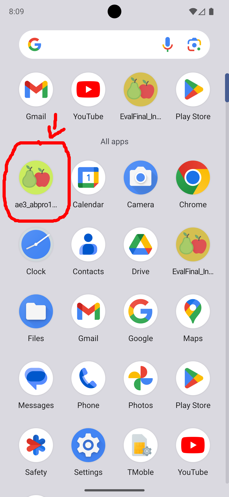
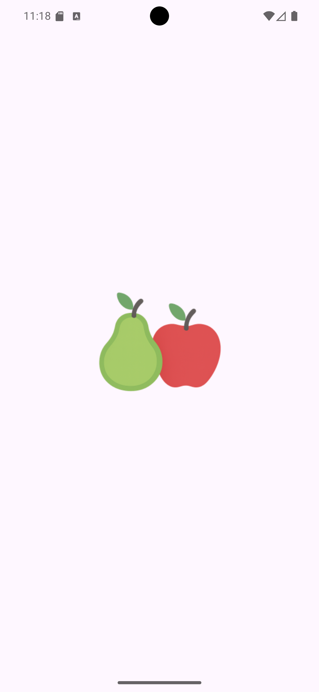
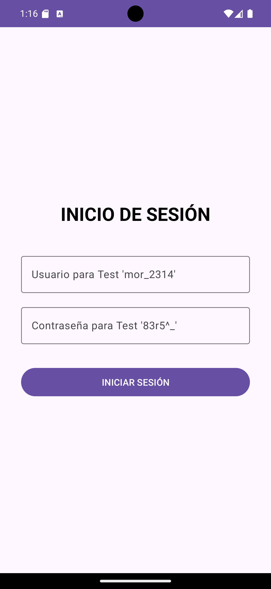
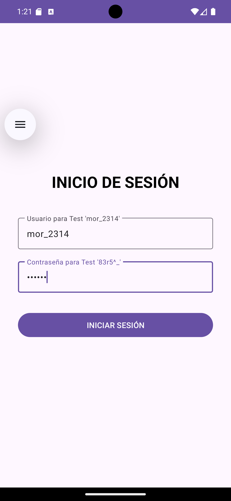
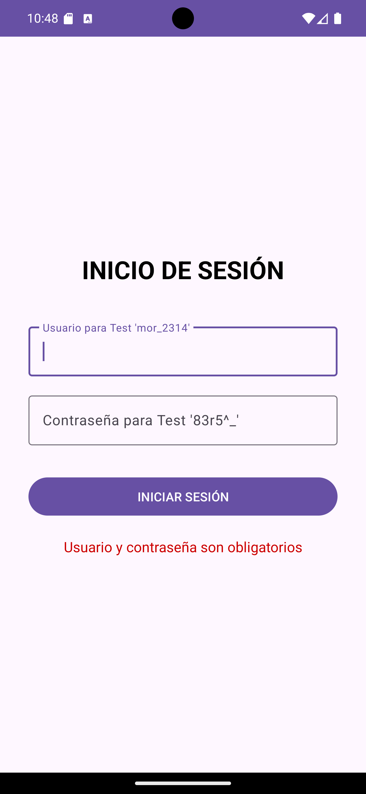
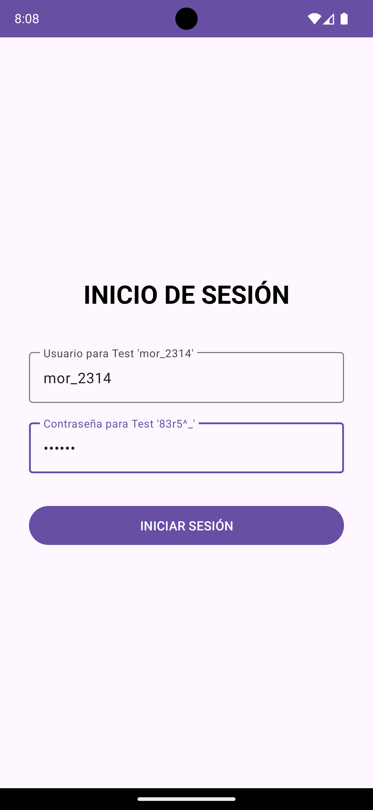
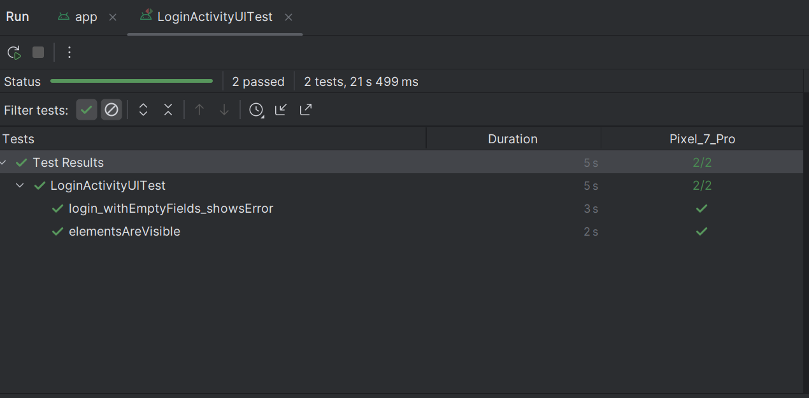
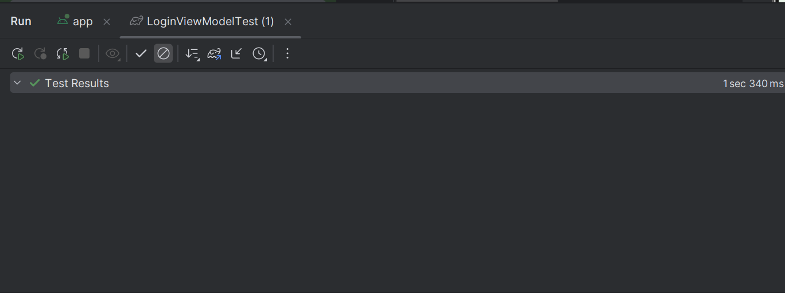
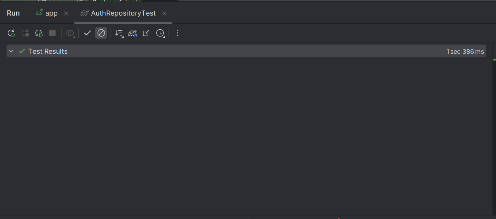

# 🚀 MOD6 AE3-ABPRO1 MVP de Autenticación con API Externa (Login + MVVM + Retrofit + Testing)

<p float="center">
  
</p>

Aplicación Android nativa en Kotlin que permite realizar **autenticación de usuario** contra una API pública

**FakeStoreAPI (`https://fakestoreapi.com/auth/login`)** .

Este MVP implementa un flujo completo de Login utilizando **MVVM** , **Coroutines** , **Retrofit** , y pruebas automáticas:

- **Pruebas de Interfaz (Espresso)**
- **Pruebas Unitarias (JUnit + Coroutine Test + MockK)**

El objetivo es validar el flujo completo de autenticación y garantizar que la aplicación responde correctamente a cada escenario:

- Usuario inválido
- Credenciales vacías
- Error de red
- Autenticación exitosa (token válido)

---

## 🎯 Requerimientos de Funcionalidad y su Implementación

| Requerimiento                 | Implementación                                                                                                               |
| ----------------------------- | ---------------------------------------------------------------------------------------------------------------------------- |
| 1. Login contra API externa   | `AuthRepository` usa **Retrofit** para consumir `POST /auth/login`. Procesa respuestas **200** , **401** , y errores de red. |
| 2. Validación local de campos | `LoginViewModel` valida **usuario** y **password** . Si están vacíos → error inmediato sin llamar a la API.                  |
| 3. Manejo de estados          | Estados definidos en `AuthState`: `Success`, `Error`, `NetworkError`, `Loading`, `Idle`.                                     |
| 4. Interfaz Reactiva          | La `LoginActivity` observa LiveData del ViewModel para actualizar UI: mensajes, progreso, navegación.                        |
| 5. Pruebas Automáticas        | Tests UI con Espresso + tests unitarios sobre Repository y ViewModel usando**MockK** , coroutines y reglas de ejecución.     |

---

## 🧠 Arquitectura y Tecnología: MVVM, Jetpack, y Persistencia

El MVP utiliza una arquitectura clara para mantener separación de responsabilidades:

| Capa                   | Componente               | Descripción                                                                                     |
| ---------------------- | ------------------------ | ----------------------------------------------------------------------------------------------- |
| **Conectividad / Red** | `AuthService (Retrofit)` | Define la llamada HTTP `login()`.                                                               |
| **Repositorio**        | `AuthRepository`         | Lógica principal: interpretador de errores (200, 401, network), entrega un `AuthState`.         |
| **ViewModel**          | `LoginViewModel`         | Valida entradas, expone estados UI mediante `LiveData`, llama al repositorio usando coroutines. |
| **Vista**              | `LoginActivity`          | Observa estados del ViewModel y actualiza la interfaz sin lógica de negocio.                    |

---

# 🔁 Flujo de Autenticación

1. Usuario abre la app, se despliega un splash inicial y luego redirecciona a pantalla Login
2. Usuario ingresa credenciales
3. Usuario presiona **Iniciar Sesión** .
4. `LoginViewModel.login()` valida campos.
   - Si vacíos → `AuthState.Error("Usuario y contraseña son obligatorios")`
5. ViewModel emite `Loading`.
6. `AuthRepository` ejecuta la llamada `POST /auth/login`.
7. Respuestas posibles:
   - **200 OK** → retorna token → `AuthState.Success`
   - **401 Unauthorized** → `AuthState.Error("Credenciales inválidas")`
   - **IOException** → `AuthState.NetworkError`
8. La UI muestra:
   - Token → navega a pantalla de éxito.
   - Error → muestra mensaje en rojo.
   - Red → mensaje de falla de conexión.

---

# 🛠️ Tecnologías Utilizadas

- **Kotlin**
- **MVVM**
- **Retrofit + Gson**
- **Coroutines**
- **LiveData**
- **Material Components**
- **JUnit 4**
- **MockK**
- **Espresso (AndroidX Test)**

---

# 🧩 Estrategia de Testeo

Se implementaron **dos niveles de pruebas** , independientes entre sí:

## 🔍 1. Pruebas Unitarias (JVM)

### 🔹 a) `AuthRepositoryTest`

| Caso probado                           | Descripción                                                                     |
| -------------------------------------- | ------------------------------------------------------------------------------- |
| **login correcto retorna token**       | Simula respuesta 200 con token → debe entregar `AuthState.Success`.             |
| **login incorrecto devuelve error**    | Respuesta HTTP**401**→ debe emitir `AuthState.Error("Credenciales inválidas")`. |
| **falla de red devuelve NetworkError** | Simulación de `IOException`→`AuthState.NetworkError`.                           |

🔧 Herramientas:

`MockK`, `runTest`, coroutines test, reglas de dispatcher.

---

### 🔹 b) `LoginViewModelTest`

Pruebas sobre la lógica y los estados expuestos a la UI.

| Caso probado                            | Descripción                             |
| --------------------------------------- | --------------------------------------- |
| **campos vacíos retorna error**         | Debe fallar sin invocar al repositorio. |
| **login exitoso devuelve token**        | Repository simula token válido → éxito. |
| **credenciales erróneas retorna error** | Repository retorna `AuthState.Error`.   |
| **error de red retorna NetworkError**   | Repository retorna `NetworkError`.      |

Estas pruebas permiten detectar errores entre ViewModel ↔ Repository.

---

## 🎨 2. Pruebas de Interfaz (Espresso)

### 🔹 a) `login_conCamposVacios_muestraError`

Valida:

- Click en botón con uno o ambos campos vacíos
- Se muestra `“Usuario y contraseña son obligatorios”` en `textViewMessage`

### 🔹 b) `elementosSonVisibles`

Verifica que los elementos esenciales de UI están presentes:

- Input usuario
- Input contraseña
- Botón **"Iniciar Sesión"**
- Barra de progreso
- Mensaje de error (inicialmente oculto)

## ⭐ Capturas de Pantalla

<table width="100%">
    <tr>
        <td align="center" width="33%">
            
        </td>
        <td align="center" width="33%">
            
        </td>
        <td align="center" width="33%">
            
        </td>
    </tr>
    <tr>
        <td align="center">App instalada</td>
        <td align="center">Splash inicial</td>
        <td align="center">Landing Login</td>
    </tr>
    <tr>
        <td align="center">
            
        </td>
        <td align="center">
            
        </td>
        <td align="center">
            
        </td>
    </tr>
    <tr>
        <td align="center">Credenciales correctas</td>
        <td align="center">Autenticación exitosa, retorna TOKEN JWT</td>
        <td align="center">Campos vacíos</td>
    </tr>
    <tr>
        <td align="center">
            
        </td>
        <td align="center">
            
        </td>
        <td align="center">
            
        </td>
    </tr>
    <tr>
        <td align="center">Credenciales incorrectas</td>
        <td align="center">Ingresar credenciales</td>
        <td align="center">Pruebas de Interfaz</td>
    </tr>
    <tr>
        <td align="center">
            
        </td>
        <td align="center">
            
        </td>
        <td align="center">
            
        </td>
    </tr>
    <tr>
        <td align="center">Pruebas Unitarias 01</td>
        <td align="center">Pruebas Unitarias 02</td>
        <td align="center">Otro desarrollo Peras con Manzanas</td>
    </tr>
</table>

---

## 🔎 Guía de Ejecución del Proyecto

**Para ejecutar este proyecto en tu entorno de desarrollo, siga estos 'quick steps':**

    1.**Clonar el Repo:** Clona el proyecto en su máquina local.

    2.**Abrir en Android Studio:** Seleccione **"Open an existing Android Studio project"** y navegue a la carpeta clonada. El IDE detectará automáticamente la configuración de Gradle.

    3.**Sincronizar Gradle:** Haz clic en el botón "Sync Now" si Android Studio te lo solicita. Esto descargará todas las dependencias necesarias.

    4.**Ejecutar:** Conecta un dispositivo Android físico o inicia un emulador. Luego, haz clic en el botón "Run 'app'" (el ícono de la flecha verde) para desplegar la aplicación.

**Para ejecutar este proyecto en tu celular, sigue estos 'quick steps':**

    1.**Copiar la APK:** Copia la aplicación (APK) en tu celular.

    2.**Instalar:** Instala la aplicación, salta los avisos de advertencia, es normal si la aplicación no ha sido productivizada la plataforma de Android.

    3.**Abrir la App:** Haz doble clic en el ícono de _**Peras con Manzanas para abrir**_ "GesTarea V5".

    4.**Recorrer las opciones:** Cliquea en las opciones y podrás acceder al listado de eventos, editar cada evento, crear nuevos eventos, regresando a cualquier punto de la app.

---

## 🛑 Instalación y Configuración

a. **Clonar el repositorio:**

```bash

https://github.com/jcordovaj/EvalFinal_InventarioAPI.git

```

b. **Abrir el Proyecto en Android Studio:**

b.1. Abrir Android Studio.

b.2. En la pantalla de bienvenida, seleccionar **"Open an existing Android Studio project"** (Abrir un proyecto de Android Studio existente).

b.3. Navegar a la carpeta donde se clonó el repositorio y seleccionarla. Android Studio detectará automáticamente el proyecto de Gradle y comenzará a indexar los archivos.

c. **Sincronizar Gradle:**

c.1. Este es el paso más importante. Después de abrir el proyecto, Android Studio intentará sincronizar la configuración de Gradle. Esto significa que descargará todas las librerías, dependencias y plugins necesarios para construir la aplicación. Normalmente, una barra de progreso se mostrará en la parte inferior de la consola de Android Studio con un mensaje como **"Gradle Sync in progress"**.

c.2. Si no se inicia, o si el proceso falla, intente con el botón **"Sync Project with Gradle Files"** en la barra de herramientas. Es el icono con el **"elefante" de Gradle**. Eso forzará la sincronización.

c.3. Esperar que el proceso de sincronización termine. De haber errores, puede ser por problemas en la configuración de Android u otros conflictos, la aplicación debe descargar lo que requiera y poder ser ejecutada "AS-IS".

d. **Configurar el Dispositivo o Emulador:**

Para ejecutar la aplicación, se requiere un dispositivo Android, puedes usarse el emulador virtual o un dispositivo físico.

d.1. Emulador: En la barra de herramientas, haga click en el botón del "AVD Manager" (Android Virtual Device Manager), que es el icono de un teléfono móvil con el logo de Android. Desde ahí, puedes crear un nuevo emulador con la versión de Android que prefiera (Nota: Debe considerar que cada celular emulado, puede requerir más de 1GB de espacio en disco y recursos de memoria).

d.2. Dispositivo físico: Conecte su teléfono Android a la computadora con un cable USB (también puede ser por WI-FI). Asegúrese de que las **Opciones de desarrollador y la Depuración por USB** estén habilitadas en su dispositivo. Consulte a su fabricante para activar estas opciones.

e. **Ejecutar la aplicación:**

e.1. Seleccione el dispositivo o emulador deseado en la barra de herramientas del emulador.

e.2. Haga click en el botón "Run 'app'" (el triángulo verde en la parte superior, o vaya al menu "RUN") para iniciar la compilación y el despliegue de la aplicación, puede tardar algunos minutos, dependiendo de su computador.

e.3. Si todo ha sido configurado correctamente, la aplicación se instalará en el dispositivo y se iniciará automáticamente, mostrando la pantalla de inicio.

---

## 📦 Generación del Paquete de Producción (APK/AAB)

Para subir la aplicación a Google Play Store o distribuirla, debes generar un paquete de _release_ (generalmente un AAB) firmado.

### 1 Generar la Clave de Firma (Si es la primera vez)

1. En Android Studio, ve a **Build > Generate Signed Bundle / APK...** .
2. Selecciona **Android App Bundle** (recomendado para Play Store) o **APK** . Haz clic en **Next** .
3. En la ventana **Key store path** , haz clic en **Create new...** .
4. Rellena todos los campos (ubicación, contraseña, _alias_ ) y haz clic en **OK** . **Guarda esta clave de forma segura.**

### 2 Generar el Paquete de Release

1. Ve a **Build > Generate Signed Bundle / APK...** .
2. Selecciona el formato deseado (AAB o APK) y haz clic en **Next** .
3. **Key store path:** Selecciona el archivo `.jks` que creaste en el paso anterior.
4. Introduce la **Key store password** y la **Key alias password** .
5. **Build variants:** Selecciona **`release`** .
6. **Signature versions:** Marca **V1 (JAR Signing)** y **V2 (Full APK Signature)** .
7. Haz clic en **Finish** .

El archivo de producción (`app-release.aab` o `app-release.apk`) se generará en el directorio `app/release/`. Este archivo está listo para su distribución.

---

## 🎉 Contribuciones (Things-To-Do)

Se puede contribuir reportando problemas o con nuevas ideas, por favor respetar el estilo de programación y no subir código basura. Puede utilizar: forking del repositorio, crear pull requests, etc. Toda contribución es bienvenida.

---

## 🔹 Licencia

GPL-3.0 license.

---
