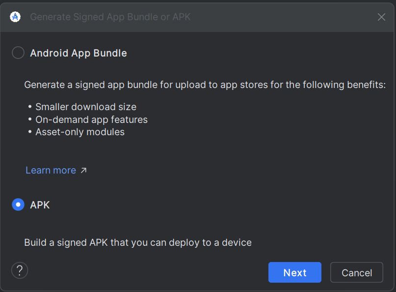
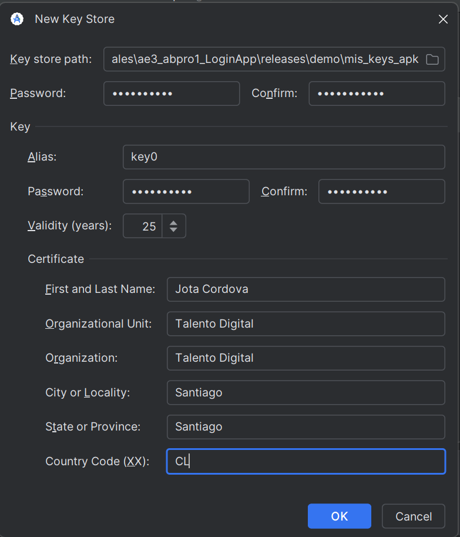
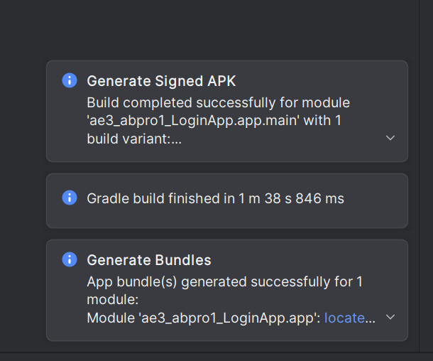

# 🚀 AE4-ABP1 Release APK (Android Package Kit) Firmado

<p float="center">
  
</p>

Guía paso a paso para generar un APK de release **firmado**, optimizado y listo para distribuir o probar en dispositivos reales.

<table width="100%">
    <tr>
        <td align="center" width="33%">
            
        </td>
        <td align="justify">Generación del kit de empaquetamiento para Android (APK)</td>
    </tr>
</table>

---

## 1) Resumen rápido

- Generar **keystore** (si no existe).
- Configurar `signingConfig` en `app/build.gradle`.
- Habilitar ofuscación y reducción (R8/ProGuard).
- Generar `assembleRelease`.
- Verificar firma y probar en dispositivo/emulador.
- Documentar.

---

## 2) Generación del keystore (firma)

- **No** compartir el keystore ni las contraseñas en el repositorio. Se debe guárdar en un lugar seguro.

- Use `keytool` (JDK) para crear un keystore:

```bash
keytool -genkeypair \
  -v \
  -keystore release-key.jks \
  -alias aqui_dale_un_nombre \
  -keyalg RSA \
  -keysize 2048 \
  -validity 10000
```

Notas:

**_release-key.jks_**: Nombre del archivo del keystore.

**_aqui_dale_un_nombre_**: Alias de la clave.

**Sigue completando las preguntas**: contraseña, nombre, organización, país, etc.

<table width="100%">
    <tr>
        <td align="center" width="33%">
            
        </td>
        <td align="justify">Generación de las claves y almacenamiento seguro</td>
    </tr>
</table>

---

## 3) Guardar credenciales seguras (opcional y recomendado)

- No pongas contraseñas en build.gradle.

- Añádelas a gradle.properties (local) o variables de entorno.

- Archivo ~/.gradle/gradle.properties (o android/gradle.properties)

```bash
RELEASE_STORE_FILE=/ruta/a/release-key.jks
RELEASE_STORE_PASSWORD=TuPasswordKeystore
RELEASE_KEY_ALIAS=my_app_key
RELEASE_KEY_PASSWORD=TuPasswordKey
```

- Verificar que gradle.properties local no esté en git (.gitignore).

---

## 4) Configurar app/build.gradle (Groovy)

- En app/build.gradle añade signingConfigs y buildTypes:

```bash
android {
compileSdkVersion 34

    defaultConfig {
        applicationId "com.tu.organizacion.app"
        minSdkVersion 21
        targetSdkVersion 34
        versionCode 1
        versionName "1.0"
    }

    signingConfigs {
        release {
            // Lee del gradle.properties
            storeFile file(RELEASE_STORE_FILE ?: "release-key.jks")
            storePassword RELEASE_STORE_PASSWORD
            keyAlias RELEASE_KEY_ALIAS
            keyPassword RELEASE_KEY_PASSWORD
        }
    }

    buildTypes {
        release {
            signingConfig signingConfigs.release
            minifyEnabled true      // Habilita R8/ProGuard
            shrinkResources true    // Elimina recursos no usados
            proguardFiles getDefaultProguardFile('proguard-android-optimize.txt'), 'proguard-rules.pro'
            // Opcional: deshabilitar debuggable, enable proguard mapping
            debuggable false
        }
        debug {
            // configuración debug
        }
    }
}
```

---

## 5) Configurar reglas ProGuard / R8

- Archivo app/proguard-rules.pro
- Mantener los modelos Gson (si los usas)

- keep class com.tu.organizacion.\*_ { _; }

- Mantener clases usadas por reflection si aplica

```bash
keepattributes _Annotation_
dontwarn okhttp3
dontwarn retrofit2
```

- Ajusta según bibliotecas utilizadas.

---

## 6) Consejos para optimización:

- Usar **minifyEnabled true** y **shrinkResources true**.

- Revisar mapping.txt (en app/build/outputs/mapping/release/) para depurar stack traces ofuscados.

- Analizar el APK con Android Studio > Build > Analyze APK... para ver tamaño y recursos.

---

## 7) Generar el APK de release

- Desde Android Studio:

        ***Build > Generate Signed Bundle / APK... → Seleccionar APK → Elegir keystore y alias → Release → Finish.***

- Desde terminal (Gradle wrapper):

        ***./gradlew clean assembleRelease***

- Por defecto, el APK firmado se encontrará en:

        ***app/build/outputs/apk/release/app-release.apk***

<table width="100%">
    <tr>
        <td align="center" width="33%">
            
        </td>
        <td align="justify">Generación del APK</td>
    </tr>
</table>

---

## 8) Verificar firma del APK

- Usar apksigner (Android SDK Build Tools) para verificar:

- Verifica la firma y muestra los certificados:

```bash
$ANDROID_SDK_ROOT/build-tools/`<version>`/apksigner verify --print-certs app/build/outputs/apk/release/app-release.apk
```

Ejemplo:

```bash
apksigner verify --print-certs app-release.apk
```

- También puedes comprobar el keystore:

```bash
keytool -list -v -keystore release-key.jks
```

- Opcional: Alinear el APK con zipalign — ya lo hace Gradle, pero si lo haces manual:

```bash
   zipalign -v -p 4 app-release-unsigned.apk app-release-aligned.apk
   apksigner sign --ks release-key.jks --out app-release-signed.apk app-release-aligned.apk
```

---

## 9) Instalar y probar en dispositivo / emulador

- Conectar dispositivo y habilitar **_Depuración USB_**.

- Instalar:

```bash
adb install -r app/build/outputs/apk/release/app-release.apk

```

Nota: "-r" reemplaza la app existente.

---

<table width="100%">
    <tr>
        <td align="center" width="33%">
            
        </td>
        <td align="justify">Aplicación instalada en dispositivo emulador (APK)</td>
    </tr>
</table>

## 10) Comprobaciones finales y buenas prácticas

- Revisar mapping.txt para depuración si usa R8.

- No subir release-key.jks ni contraseñas al repositorio.

- Automatiza firma con CI (GitHub Actions/Bitrise) usando secretos.

- Probar en varios dispositivos y APIs.

---

## 11. Checklist (para documentar)

- Keystore generado y guardado en lugar seguro

- **build.gradle** configurado con **_signingConfig_**

- **minifyEnabled** y reglas de **ProGuard** definidas

- **assembleRelease** produce APK firmado

- **apksigner verify** OK

- APK instalado y funcional en dispositivo real

- Keystore creation

- Configuración build.gradle

- Resultado Build > APK

- apksigner verify

- APK instalado en dispositivo

---

## 12) Problemas comunes y soluciones

- APK no firmado: revisar signingConfig y que las variables de contraseña existan.

- Errores R8/ProGuard: revisar reglas y añadir -keep cuando faltan clases por reflexion.

- APK grande: revisar dependencias, usar shrinkResources true, usar implementation en vez de api en Gradle.

---

## 13) Referencias

- Android Docs — Sign your app

- Android Docs — Reduce app size

- keytool, apksigner, zipalign, bundletool (ver guía AAB)

---
